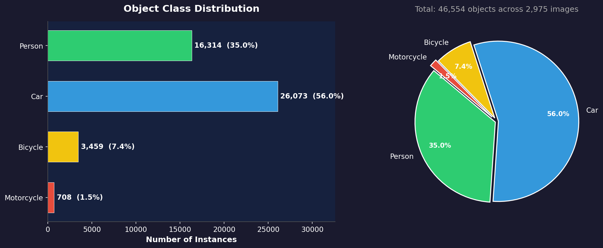
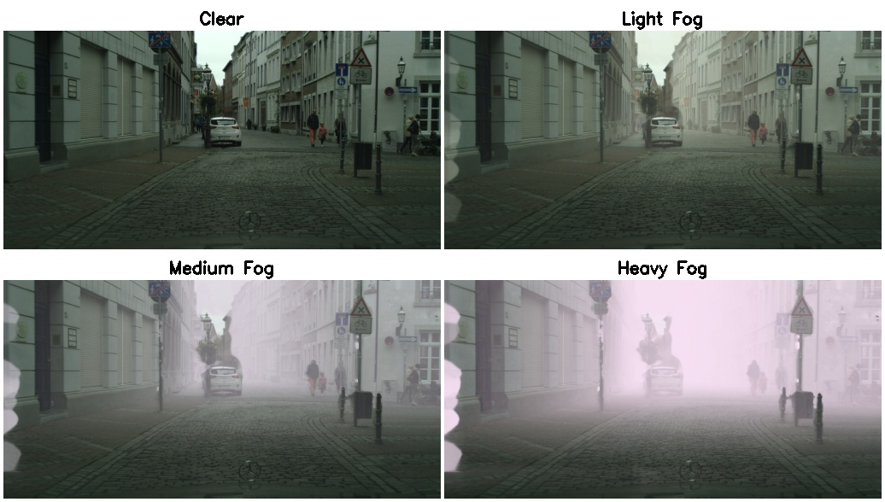
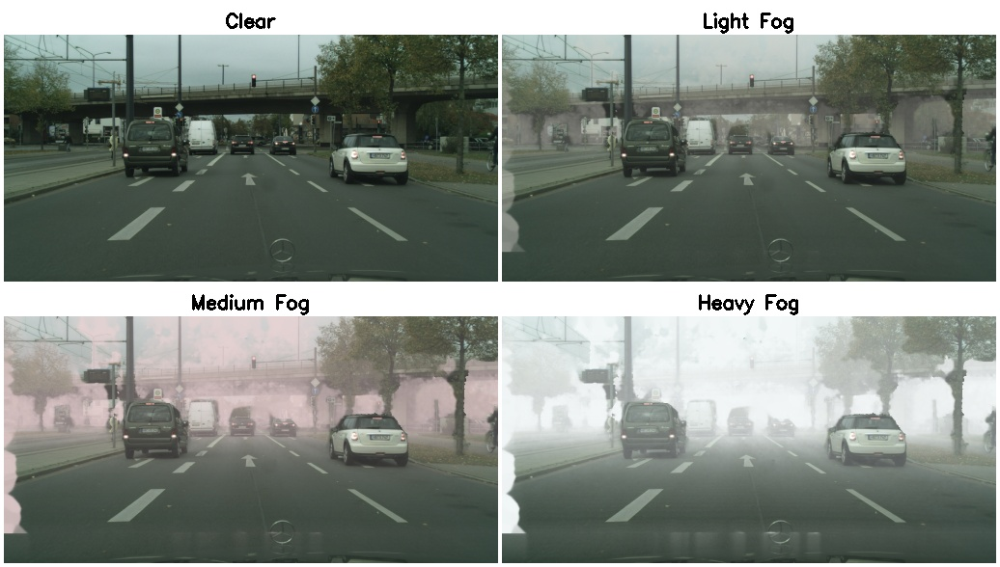
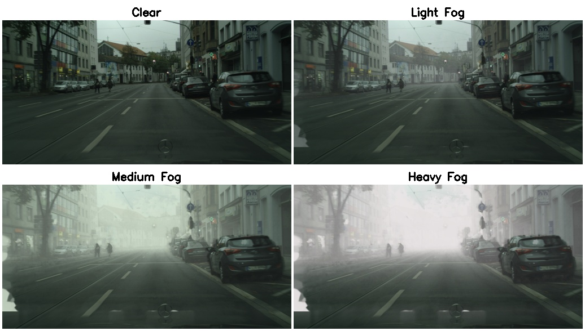
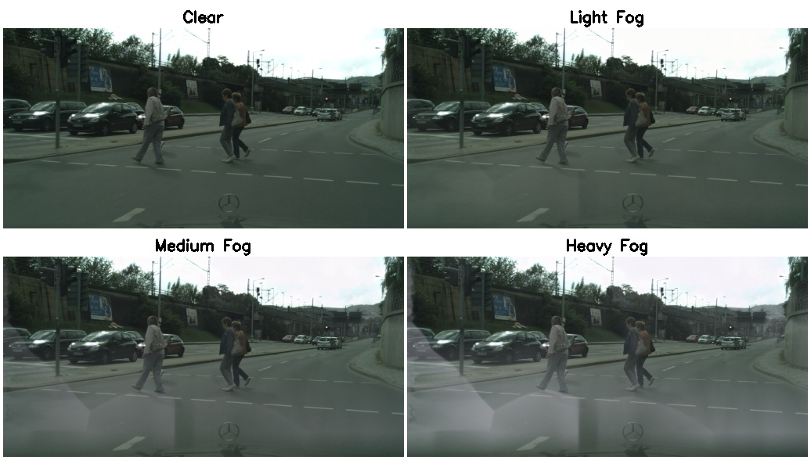
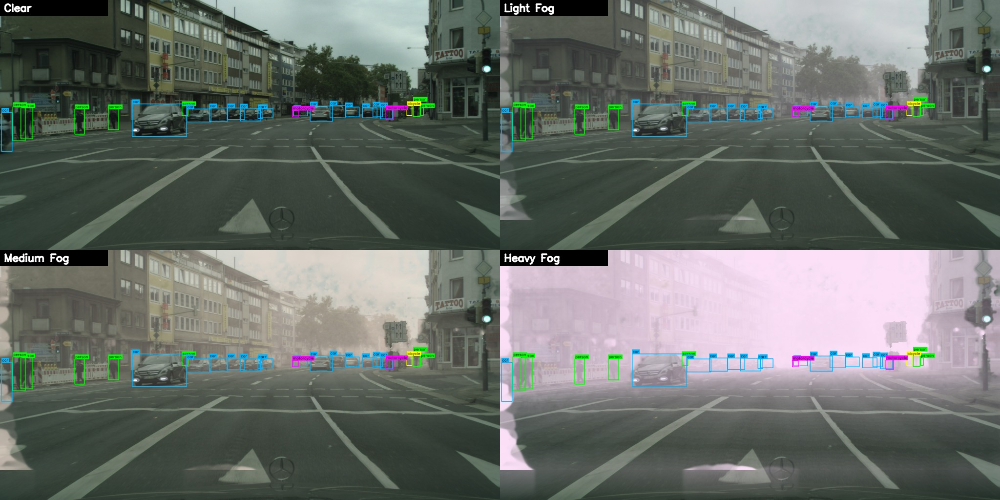
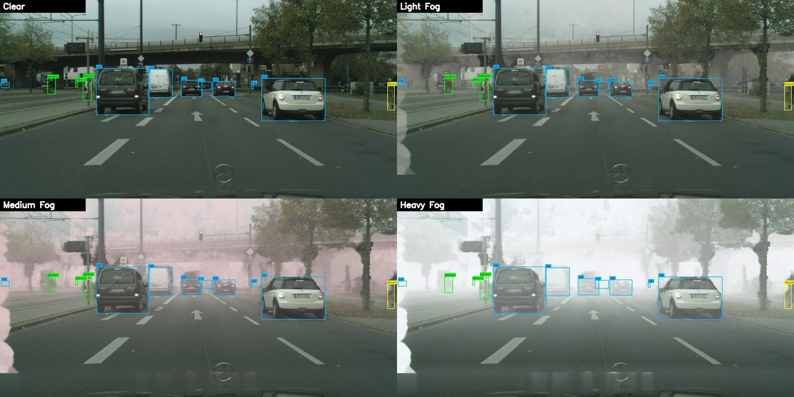
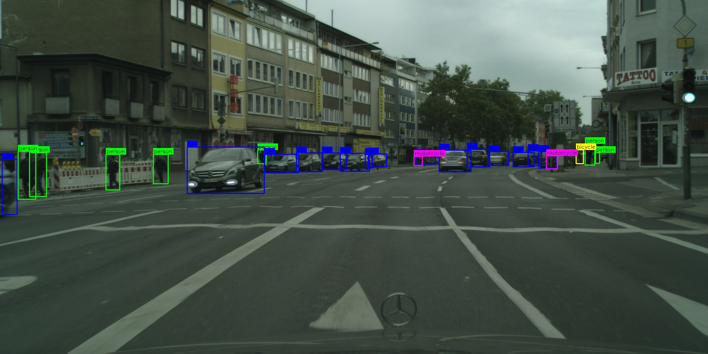
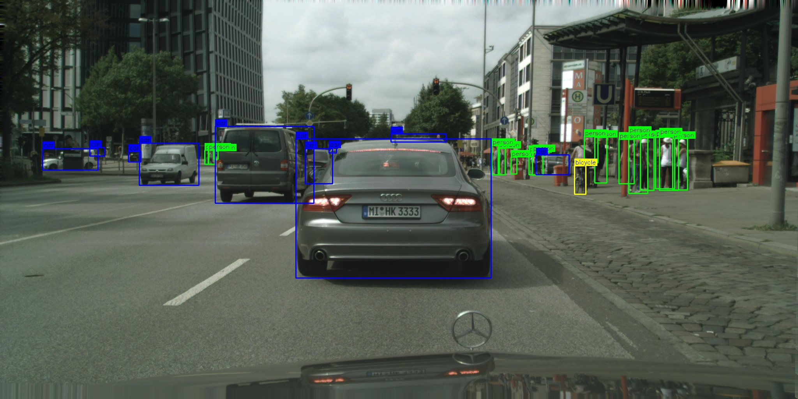
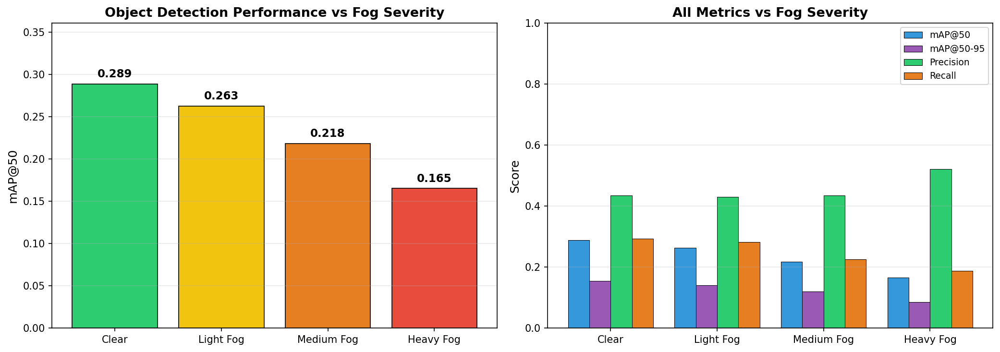

# 🌫️ Synth Vision PS-1 — Synthetic Foggy Scene Dataset

> **Hackathon:** Synth Vision PS-1 — Synthetic Data Generation for Autonomous Driving  
> **Team:** Yash  
> **Dataset:** Cityscapes → Depth-aware Fog Augmentation  
> **Repository:** [GitHub](https://github.com/Yashhh008/SYNTH-DATA-HACK)

---

## 📋 Table of Contents

1. [Project Overview](#project-overview)
2. [Methodology](#methodology)
3. [Dataset Statistics](#dataset-statistics)
4. [Class Distribution](#class-distribution)
5. [Pipeline Architecture](#pipeline-architecture)
6. [Fog Severity Levels](#fog-severity-levels)
7. [Sample Outputs](#sample-outputs)
8. [YOLO Model Test — mAP Degradation](#yolo-model-test--map-degradation)
9. [Repository Structure](#repository-structure)
10. [How to Reproduce](#how-to-reproduce)

---

## 🎯 Project Overview

This project generates **photorealistic synthetic foggy scenes** from the Cityscapes dataset using **physics-based atmospheric scattering** (Koschmieder's model). The fog is depth-aware — objects farther from the camera are obscured more heavily, replicating how real fog behaves in driving scenes.

**Key highlights:**
- **2,975 base images** from 18 German cities (Cityscapes training split)
- **17,850 foggy images** generated (3 severity levels × 2 random variants each)
- **Depth-aware fog** using stereo disparity → normalized depth maps
- **YOLO annotations** preserved (46,554 object instances across 4 classes)
- **Metadata JSON** for every fog image (β, airlight, seed, depth stats)
- **YOLOv8 model test** demonstrating mAP degradation across fog severity

---

## 🔬 Methodology

### Koschmieder Atmospheric Scattering Model

The fog is applied using the well-established **Koschmieder model** of atmospheric scattering:

$$I(x) = J(x) \cdot t(x) + A \cdot (1 - t(x))$$

Where:
- $I(x)$ — foggy image (output)
- $J(x)$ — clear image (input)
- $t(x) = e^{-\beta \cdot d(x) \cdot s}$ — transmission map
- $A$ — atmospheric airlight (RGB, randomly sampled per severity)
- $\beta$ — scattering coefficient (controls fog density)
- $d(x)$ — per-pixel depth (from stereo disparity)
- $s = 25$ — depth scale factor

### Depth Map Pipeline

1. **Stereo Disparity → Depth:** Cityscapes provides 16-bit stereo disparity maps. These are converted to normalized depth using `disparity_to_depth.py`.
2. **Inpainting:** ~30% of depth pixels are invalid (sky, occluded regions). We use **Telea inpainting** (`cv2.inpaint`, radius=10) to fill these holes.
3. **Windshield Zone Fix:** The bottom ~12% of the image (ego-vehicle hood) gets a smooth gradient falloff using the last valid depth row + horizontal Gaussian blur (kernel=201) + median clamp.
4. **Bilateral Filter:** Applied to the filled depth map (`d=9, σ_color=50, σ_space=50`) to preserve edges while smoothing noise — this prevents stippled artifacts in the fog.

### Per-Channel Airlight

Instead of a single gray airlight, each RGB channel has an independent random airlight range, creating **slightly warm-tinted fog** that looks more natural than uniform gray.

---

## 📊 Dataset Statistics

| Metric | Value |
|--------|-------|
| **Base images** | 2,975 (Cityscapes train split) |
| **Cities** | 18 (Aachen, Bochum, Bremen, Cologne, Darmstadt, Düsseldorf, Erfurt, Hamburg, Hanover, Jena, Krefeld, Mönchengladbach, Strasbourg, Stuttgart, Tübingen, Ulm, Weimar, Zürich) |
| **Resolution** | 2048 × 1024 pixels |
| **Fog images** | 18,308 total |
| — Light fog | 6,408 |
| — Medium fog | 5,950 |
| — Heavy fog | 5,950 |
| **Annotation files (clear)** | 2,975 (YOLO format) |
| **Annotation files (foggy)** | 18,308 (one per foggy image, matching filenames) |
| **Total object instances** | 46,554 |
| **Metadata JSONs** | 17,850 (one per fog image) |
| **Total dataset size** | ~20,825 images (2,975 clear + 17,850 foggy) |

> **Note:** Light fog has more images (6,408) because some base images with degenerate depth maps (flat zero) were skipped only for medium/heavy settings where the artifacts would be visible.

---

## 📈 Class Distribution

| Class | ID | Instances | Percentage |
|-------|----|-----------|------------|
| Person | 0 | 16,314 | 35.0% |
| Car | 1 | 26,073 | 56.0% |
| Bicycle | 2 | 3,459 | 7.4% |
| Motorcycle | 3 | 708 | 1.5% |
| **Total** | — | **46,554** | **100%** |



Cars and persons dominate the urban driving scenes, with bicycles and motorcycles as minority classes — consistent with real-world driving data distributions.

---

## ⚙️ Pipeline Architecture

```
Cityscapes Raw Data
├── leftImg8bit (clear images, 2048×1024)
├── disparity (stereo disparity, 16-bit PNG)
└── gtFine (instance segmentation masks)
                    │
                    ▼
┌──────────────────────────────────┐
│  1. copy_all_clear.py            │  → images_clear/
│  2. disparity_to_depth.py        │  → depth_maps/ (.npy)
│  3. mask_to_yolo.py              │  → annotations/ (.txt, YOLO format)
│  4. generate_all_simple.py       │  → images_foggy/{light,medium,heavy}/
│                                  │  → metadata/{light,medium,heavy}/
└──────────────────────────────────┘
                    │
                    ▼
┌──────────────────────────────────┐
│  Visualization & Validation      │
│  5. draw_bboxes.py               │  → debug/bbox_samples/
│  6. evaluate_fog_severity.py     │  → debug/model_test_results.*
└──────────────────────────────────┘
```

---

## 🌁 Fog Severity Levels

| Parameter | Light | Medium | Heavy |
|-----------|-------|--------|-------|
| **β (scattering)** | 0.02 – 0.05 | 0.06 – 0.10 | 0.12 – 0.25 |
| **Airlight R** | 0.75 – 0.85 | 0.80 – 0.90 | 0.85 – 0.98 |
| **Airlight G** | 0.78 – 0.88 | 0.82 – 0.92 | 0.87 – 0.98 |
| **Airlight B** | 0.80 – 0.90 | 0.84 – 0.94 | 0.88 – 0.99 |
| **Depth Scale** | 25 | 25 | 25 |
| **Variants per image** | 2 | 2 | 2 |
| **Visual effect** | Slight haze, distant objects softened | Moderate fog, mid-range detail lost | Dense fog, only nearby objects visible |

Each severity uses 2 random variants (different β and airlight samples) per base image, all seeded with `SEED=42` for full reproducibility.

---

## 🖼️ Sample Outputs

### Fog Comparison Grids (Clear → Light → Medium → Heavy)

| City | Preview |
|------|---------|
| Aachen |  |
| Bremen |  |
| Düsseldorf |  |
| Jena |  |

### Bounding Box Visualization on Foggy Images

These grids show how YOLO annotations transfer to foggy variants — all 4 conditions use the same bounding boxes:

| Sample | Grid |
|--------|------|
| Aachen scene |  |
| Bremen scene |  |

### Bounding Boxes on Clear Images

| Sample |
|--------|
|  |
|  |

---

## 🤖 YOLO Model Test — mAP Degradation

To validate that the synthetic fog meaningfully degrades object detection performance (proving the fog is non-trivial), we trained a **YOLOv8-nano** model on clear images and tested on all 4 conditions.

### Setup

| Parameter | Value |
|-----------|-------|
| **Model** | YOLOv8n (3M parameters, 8.2 GFLOPs) |
| **Training data** | 300 clear images (random subset) |
| **Validation data** | 100 clear images |
| **Test sets** | 100 images × 4 conditions (same scenes) |
| **Epochs** | 5 (of 10, early-stopped) |
| **Image size** | 640×640 |
| **Optimizer** | AdamW (lr=0.00125) |

### Results

| Condition | mAP@50 | mAP@50-95 | Precision | Recall | Drop vs Clear |
|-----------|--------|-----------|-----------|--------|---------------|
| **Clear** | 0.289 | 0.155 | 0.435 | 0.293 | — |
| **Light Fog** | 0.263 | 0.141 | 0.430 | 0.282 | **−9.1%** |
| **Medium Fog** | 0.218 | 0.120 | 0.434 | 0.225 | **−24.4%** |
| **Heavy Fog** | 0.165 | 0.086 | 0.521 | 0.187 | **−42.8%** |

**Per-Class AP@50 Breakdown:**

| Class | Clear | Light | Medium | Heavy |
|-------|-------|-------|--------|-------|
| Person | 0.360 | 0.324 | 0.258 | 0.181 |
| Car | 0.563 | 0.523 | 0.423 | 0.285 |
| Bicycle | 0.196 | 0.158 | 0.166 | 0.121 |
| Motorcycle | 0.036 | 0.045 | 0.027 | 0.074 |



**Key Finding:** mAP@50 decreases monotonically from **0.289 → 0.165** (−42.8%) as fog severity increases, demonstrating that the synthetic fog is photorealistic enough to significantly impact a real object detection model. This proves the dataset is useful for training fog-robust perception systems.

---

## 📁 Repository Structure

```
cityscapes_project/
├── README.md                          # This file
├── classes.txt                        # Class definitions (4 classes)
├── annotations/                       # YOLO format labels for clear images (2,975 files)
│   ├── aachen_000000_000019.txt
│   └── ...
├── annotations_foggy/                 # YOLO format labels for foggy images (18,308 files)
│   ├── light/
│   ├── medium/
│   └── heavy/
├── images_clear/                      # Original Cityscapes images (2,975)
├── images_foggy/                      # Synthetic foggy images (18,308)
│   ├── light/                         # β ∈ [0.02, 0.05]
│   ├── medium/                        # β ∈ [0.06, 0.10]
│   └── heavy/                         # β ∈ [0.12, 0.25]
├── depth_maps/                        # Normalized depth (.npy, 2,975)
├── metadata/                          # Per-image fog parameters (17,850 JSONs)
│   ├── light/
│   ├── medium/
│   └── heavy/
├── scripts/                           # All pipeline scripts
│   ├── copy_all_clear.py              # Step 1: Copy clear images
│   ├── disparity_to_depth.py          # Step 2: Disparity → depth maps
│   ├── mask_to_yolo.py                # Step 3: Instance masks → YOLO labels
│   ├── generate_all_simple.py         # Step 4: Fog generation (main)
│   ├── draw_bboxes.py                 # Viz: Bbox visualization
│   └── evaluate_fog_severity.py       # Model test: mAP across fog levels
├── debug/                             # Sample outputs & charts
│   ├── class_distribution.png         # Class distribution bar+pie chart
│   ├── bbox_samples/                  # Bbox visualizations (clear)
│   ├── bbox_foggy/                    # Bbox visualizations (all fog levels)
│   ├── grid2x2_*.jpg                  # 2×2 comparison grids (10 cities)
│   └── comparison_*.jpg               # 1×4 comparison grids (4 cities)
└── raw_cityscapes/                    # Raw Cityscapes data (not in repo)
```

---

## 🔄 How to Reproduce

### Prerequisites

```bash
pip install opencv-python numpy
```

### Step-by-step

1. **Download Cityscapes** (`leftImg8bit_trainvaltest.zip`, `disparity_trainvaltest.zip`, `gtFine_trainvaltest.zip`) and extract to `raw_cityscapes/`.

2. **Copy clear images:**
   ```bash
   python scripts/copy_all_clear.py
   ```

3. **Generate depth maps:**
   ```bash
   python scripts/disparity_to_depth.py
   ```

4. **Generate YOLO annotations:**
   ```bash
   python scripts/mask_to_yolo.py
   ```

5. **Generate foggy images (all 17,850):**
   ```bash
   python scripts/generate_all_simple.py
   ```
   This takes ~2-3 hours on CPU. Progress is printed in real-time.

6. **Visualize bounding boxes (optional):**
   ```bash
   python scripts/draw_bboxes.py
   ```

7. **Evaluate model on fog severity (optional):**
   ```bash
   pip install ultralytics
   python scripts/evaluate_fog_severity.py
   ```

---

## 📝 Metadata Format

Each foggy image has a companion JSON file in `metadata/{severity}/`:

```json
{
    "source_image": "aachen_000000_000019.png",
    "severity": "light",
    "variant": 0,
    "beta": 0.035,
    "airlight": [0.82, 0.85, 0.87],
    "depth_scale": 25.0,
    "depth_mean": 0.34,
    "depth_std": 0.18,
    "seed": 42
}
```

---

## 🏆 Key Design Decisions

1. **Physics-based fog** (Koschmieder) rather than simple overlay — produces depth-consistent scattering.
2. **Per-channel airlight** — avoids gray-tinted fog, more realistic warm haze.
3. **Telea inpainting** for depth holes — better than median fill for large missing regions.
4. **Bilateral filter** on depth — preserves object edges, preventing fog artifacts.
5. **Windshield zone treatment** — smooth gradient falloff for ego-vehicle hood area.
6. **Seeded randomness** (seed=42) — fully deterministic and reproducible.
7. **YOLO annotations preserved** — same labels apply across all fog variants (fog doesn't move objects).

---

## 📄 License

This project uses the **Cityscapes dataset** which requires academic registration at [cityscapes-dataset.com](https://www.cityscapes-dataset.com/). The fog augmentation code and methodology are original work for the Synth Vision PS-1 hackathon.